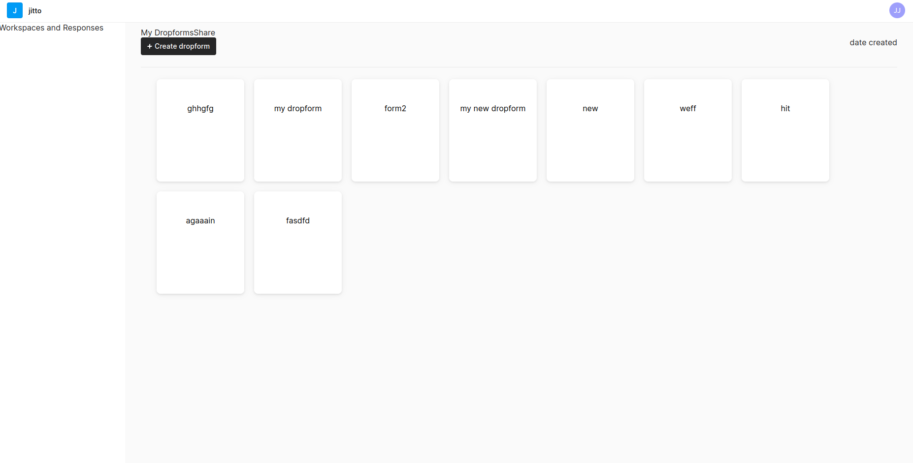
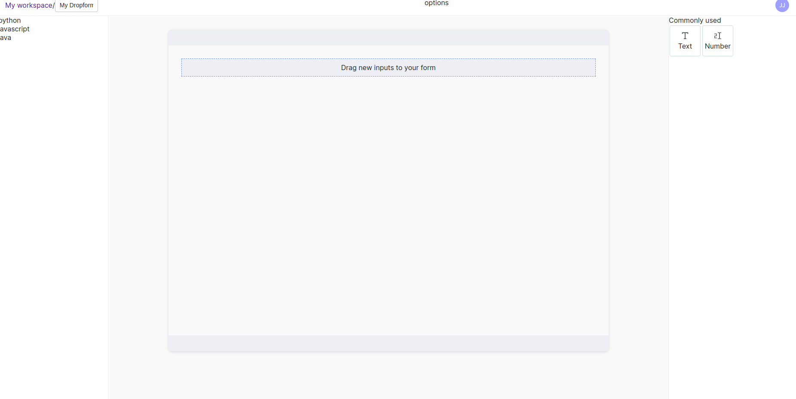
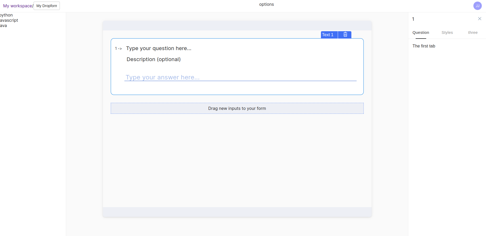
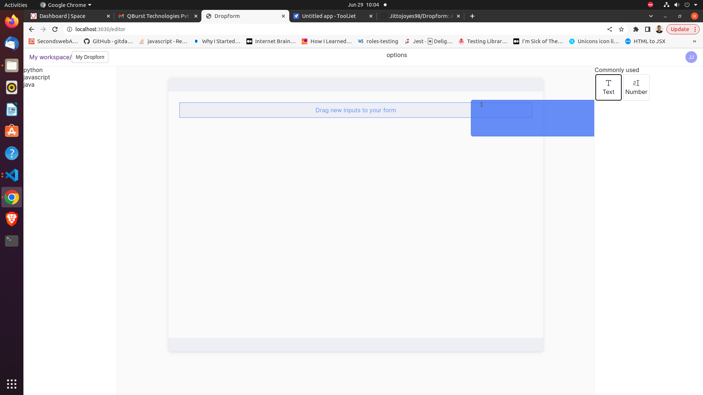

# Dropform

**_Installation_**

1. Firstly, clone the repository: `git clone git@github.com:Jittojoyes98/Dropform.git`.
2. Run `npm install` to install the dependencies.
3. Rename `.env.example` to `.env` and populate the keys with the relevant information.

**_Usage_**

- To run the server locally, run: `npm run serve`
- Your server will start at `http://localhost:3030`.

**_What is Dropform?_**

- A React Web App where users can create customizable forms.
- Realtime updation of forms.
- As of now only numbers and text fields.
- The project is in progress (Plenty of things to be completed), new features and suggestions are welcome.Feel free to open issues if there is any bug.

**_Screenshots:_**

Dashboard :

Editor :

Form Elements :

Drag and Drop :

**_About:_**

A Web App to create custom forms using drag and drop functionality. User will be able to set custom settings for each form elements.

- **_Tech Stack:_**

- React.js
- Supabase
- Zustand
- SCSS
- Material UI

**_Want to Contribute?_**

 

**_Contact:_**

- [LinkedIn](https://www.linkedin.com/in/jittojoyes/)

- [Github](https://github.com/Jittojoyes98/)
